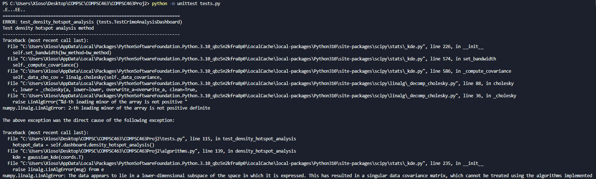

Project Repository for COMPSC463 Project 2.

# Project Description

In this project, students will have the opportunity to propose and develop their own project related to the theme of crime/violence. The goal is to encourage students to apply their knowledge of algorithms to a relevant and meaningful problem in the context of crime/violence. In this group project assignment, you and your team member will embark on a creative and meaningful journey to develop a software application that reflects the knowledge and skills you have acquired in this course. This project serves as a culmination of your learning experience, aiming to apply what you've learned to solve real-world problems through software development and teamwork. Students are encouraged to explore various aspects of crime/violence such as crime and violence, such as crime detection and monitoring, resource allocation for law enforcement, strategies for crime prevention and community safety, data logging and real-time analysis of crime patterns, simulation and forecasting of crime trends, and emergency communication systems for crisis response, or any other related area of interest. Through this project, students will have the flexibility to showcase their creativity, critical thinking, and technical skills while addressing important challenges in the crime/violence problem.

 

*Project Groups*

To facilitate collaboration and ensure that every student has the opportunity to work with a team member, group formation will follow the following guidelines:

- Two-Person Groups: Students are encouraged to form their own groups consisting of two individuals who share a common interest or preference in the project topic. These groups should be formed voluntarily.
- Remaining Students: If there is an odd number of students or if an individual is unable to find a partner, they will be assigned to a group by the faculty. The faculty will make reasonable efforts to create groups that align with students' interests and skills.
- Faculty-Assigned Groups: In cases that students are unable to find a partner or request faculty assistance, the faculty can assign groups to ensure that every student is part of a team.

*Expected Skills Gained*

- Critical and creative thinking
- Developing a user-friendly interface
- Collaborative coding
- Real-world application
- Problem solving 

*Deliverables*

- Source Code: Submit the source code, including comments that explain the design and implementation. Store the code on a GitHub repository.

- Project Report: Prepare a comprehensive project report that includes the following.

    1. Project goals: Clearly define the project's objectives.

    2. Significance and novelty of the project: Background information and Why the project is meaningful and novel.

    3. Installation and usage instructions: Provide clear instructions for installing and using the software.

    4. Code structure: Present a systematic flow-chart of the code's structure and explanations for easy understanding.

    5. List of functionalities and verification results: Describe the functionalities and present testing results for verification.

    6. Showcasing the achievement of project goals: Provide some execution results and discuss your result on how your project achieves the project goal

    7. Discussion and Conclusions: Address project issues, limitations, and how your course learning were applied.

- GitHub Repository Link: Share a GitHub repository link with the project report as a README (Markdown file, Word, or pdf) and the source code as a separate file.
 

*Grading Criteria*

Your project will be assessed according to the following criteria:

- Code (15%)
    - Code Quality: Code should be well-structured and readable.

- Report (75%)
- Goal of the project (5%)
    - Clearly state the project's objectives.

- Significance of the project (10%)
    - Explain the project's meaningfulness and novelty

- Installation and Instruction to use (5%)
    - Provide clear installation and usage instructions.

- Structure of the code (5%)
    - Include a systematic code structure diagram and clear explanations.

- Functionalities and Test Results (15%)
    - Present functionalities and testing results for verification.

- Showcasing the achievement of project goals (15%)
    - Present the results and discuss the implementation to show off the achievement of the project goal

- Discussion and Conclusions (10%)
    - Discuss project issues, limitations, and the application of course learning.

- Overall quality of report (10%)
    - editing and quality of writing, 

- GitHub (10%)
    - Ensure all project components are on the GitHub repository.
    - Set the GitHub repository as public initially.

 

*Submission*

- Your project submission should include a GitHub repository link containing all the required deliverables for evaluation.
- Each student needs to submit their project on Canvas individually even though they submit the same link.

 

*Note*

- Ensure that within your group, every member respects each other's contributions, including your own. If your team demonstrates harmonious dynamics and all members, including yourself, contributed equally, the same score will be assigned to all members of the group. In the event that you or another team member argues that your own or another member's contribution is weak, the faculty will listen to the perspectives of all group members, including yours, and decide the scores accordingly. This ensures fair assessment of individual contributions within the team.

- Everything here can be subject to change with common-sense reasoning

# Code Structure
report_images (Not relevant to application) 
    └── image-1.png 
    └── image-2.png 
    └── image.png 

COMPSC463Proj1 
    └── main.py 
    └── algorithm.py 
    └── tests.py 

- main.py: Driver code for the application.

- algorithm.py: Contains the various algorithms used to produce the analysis results based on the data.
  - Classes:
    - FinancialDataPoint: Stores a single point of financial data
    - AnomalyReport: Stores information about detected anomalies
  - Methods:
    - load_data: Initializes the analyzer with financial data
      - load_csv: Loads given CSV file and passes data into `load_data()`
    - merge_sort: Implementation of merge sort with O(n log n) complexity; Sorted list of FinancialDataPoint objects
      - _merge: Helper function for merge sort
    - find_max_subarray: Finds period of maximum gain using divide-and-conquer
    - detect_anomalies: Uses rolling statistics and z-scores for detection of unusual price movements
    - generate_report: Combines results from all analysis functions

- tests.py: Test cases for application functions.

# Tutorial

*Required Installs*
pip install numpy pandas matplotlib

*Guide*
- Run `git clone https://github.com/MajaSLash/COMPSC463Proj1.git` in your terminal to download this repository.
- Download a dataframe from Kaggle to a CSV file (Instructions linked [here](https://www.kaggle.com/discussions/getting-started/58426)).
- Move the file into this project's directory.
- Run the program from main.py
- When prompted, enter the filename into the project.
- To use the test case suite, run `python -m unittest tests.py -v` in your terminal.

# Test Cases

*Main Program Test Cases*
The test case option for the main program can be accessed when no CSV file is entered. This will generate random data to be inserted into the program.
- Example Usage:
  - Output: 
  - Chart: 

*Test Cases for Individual Parts*
Indiviudal Cases for each function are located in test.py
- Example Usage:
  - Output: 
# Conclusion
This project has helped demonstrate the usefulness of the material learned in COMPSC463 so far in the semester. The program utilized the many different algorithms and general coding ability of the student in order to successfully complete it. The inclusion of the different algorithms did not feel too out of place, as well as the project topic felt natural to what could be encountered in the development industry. One improvement that could be added to this project (as it was not needed, but I included anyway in my version) is the importance of the built-in test cases. This improves efficiency for the grader, as they do not have to insert values manually into the program in order to validate the program and instead can have the option of a "TEST" mode.